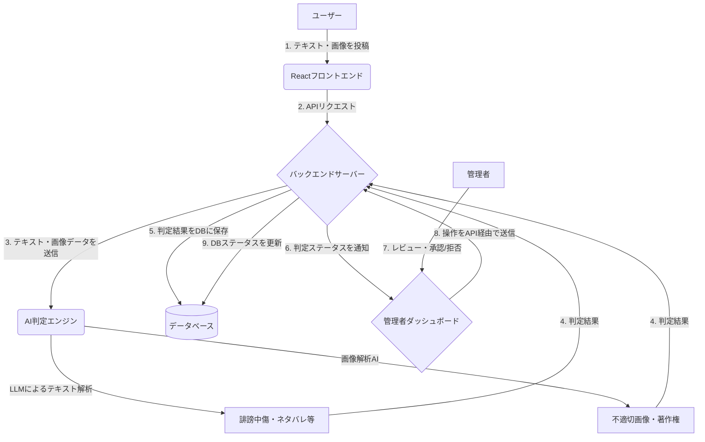

はい、承知いたしました。漫画アプリにおけるユーザー投稿コンテンツのAI監視システムについて、Reactでの実装を想定した詳細な仕様と実装方針を以下に提案します。

-----

## **AI監視システムの開発仕様・実装方針**

本システムは、ユーザーが投稿するテキスト・画像コンテンツをLLM（大規模言語モデル）および生成AI技術を用いてリアルタイムに監視し、不適切な投稿やネタバレなどのリスク投稿を自動検出することを目的とします。

### **1. システム概要**

ユーザーの投稿フローにAIによるコンテンツ解析を組み込み、その判定結果に応じて「自動承認」「要手動レビュー」「自動拒否」のステータスを付与します。管理者は専用のダッシュボード（Reactで構築）から「要手動レビュー」と判定されたコンテンツを確認し、最終的な公開可否を判断します。

-----

### **2. 詳細仕様**

#### **2.1. 監視対象コンテンツ**

  * **テキスト:** コメント、レビュー、掲示板への書き込みなど、ユーザーが入力する全てのテキスト。
  * **画像:** ユーザーがアップロードするファンアート、作品に関する画像など。

#### **2.2. 検出対象のリスクとAIの判定基準**

| リスク種別 | 主な判定基準（AIへの指示内容） |
| :--- | :--- |
| **誹謗中傷** | 特定の人物・作品・キャラクターへの悪意ある、または攻撃的な表現を検出。 |
| **公序良俗違反** | 暴力的、性的、差別的な内容、ヘイトスピーチを検出。 |
| **ブランド毀損** | アプリ運営会社や掲載作品の評判を不当に貶める内容を検出。 |
| **ネタバレ** | **投稿箇所のメタデータ（作品名・話数）** を基に、物語の核心に触れる展開（例：「犯人は〇〇」「最終回で〇〇が死ぬ」）を示唆する表現を文脈から検出。 |
| **著作権侵害（画像）**| ・**OCR（光学的文字認識）**: 画像内のテキストを抽出し、セリフやタイトルからネタバレや作品ページの無断転載を検出。\<br\>・**特徴点分析**: 漫画のコマをスキャン・撮影した画像を検出。（高度な機能） |
| **その他** | スパム/広告、個人情報（電話番号、住所など）の書き込みを検出。 |

#### **2.3. AI判定後の処理フロー**

AIは各リスク項目に対して**0.0〜1.0のリスクスコア**を算出します。このスコアに基づき、システムは投稿を自動で振り分けます。

  * **自動承認 (例: スコア \< 0.3)**
      * リスクが極めて低いと判断された投稿。即時公開されます。
  * **要手動レビュー (例: 0.3 ≦ スコア \< 0.8)**
      * AIが判断に迷った、文脈依存性の高い投稿。
      * 管理者ダッシュボードのレビューキューに追加され、人間の目による確認を待ちます。
  * **自動拒否 (例: スコア ≧ 0.8)**
      * 明らかに規約に違反する投稿。
      * 投稿は非公開となり、DBにログが保存されます。

#### **2.4. 管理者向けダッシュボードの機能（Reactで実装）**

  * **レビュー待ち一覧:** 「要手動レビュー」と判定された投稿をカード形式で一覧表示。
  * **投稿詳細表示:**
      * 投稿されたテキストや画像。
      * AIの判定結果（検出されたリスク種別、リスクスコア、AIによる判定理由の要約）。
      * 投稿者の情報（ユーザーID、過去の違反履歴など）。
  * **承認・拒否アクション:** 管理者がワンクリックで「承認」または「拒否」を選択可能。
  * **拒否理由のテンプレート化:** 拒否する際に、理由のテンプレート（例：「ネタバレを含むため」「不適切な表現」）を選択。ユーザー通知に活用。
  * **検索・フィルタリング:** ユーザーID、リスク種別、期間などでレビュー対象を絞り込み検索。
  * **統計分析:** 日別・リスク種別の検知数や、管理者の対応状況などをグラフで可視化。

-----

### **3. 実装方針**

#### **3.1. フロントエンド (React)**

  * **UIライブラリ:** **MUI (Material-UI)** や **Ant Design** を採用し、高機能な管理者ダッシュボードを効率的に構築します。
  * **状態管理:** **Redux Toolkit** または **Zustand** を使用し、レビュー対象の投稿リストやフィルター条件など、アプリケーション全体の複雑な状態を一元管理します。
  * **データ取得:** **TanStack Query (旧React Query)** を導入し、バックエンドからのデータ取得、キャッシュ、非同期状態の管理を効率化します。これにより、ローディングやエラー状態のハンドリングが容易になります。
  * **コンポーネント設計:**
      * `ModerationDashboard.tsx`: ダッシュボード全体のレイアウトコンポーネント。
      * `ReviewList.tsx`: レビュー待ち投稿の一覧を表示。
      * `ReviewCard.tsx`: 個々の投稿の詳細とアクションボタンを持つコンポーネント。
      * `AnalyticsView.tsx`: 統計グラフを表示するコンポーネント。

#### **3.2. バックエンド**

  * **技術スタック:** Node.js (Express/NestJS) や Python (FastAPI) など、非同期処理に強いフレームワークを選定。
  * **AI API連携:**
      * バックエンドサーバーから、**Google Cloud AI Platform (Vertex AI)** や **Amazon Bedrock**, **OpenAI API** などの外部LLM APIを呼び出します。
      * プロンプトには、判定基準、出力形式（JSON推奨）、そして漫画アプリ特有の文脈を Few-shot Learning の形式で含めることで、判定精度を高めます。
      * 画像解析には **Google Cloud Vision API** や **Amazon Rekognition** のセーフサーチ機能、OCR機能を活用します。
  * **非同期処理:** ユーザーの投稿体験を損なわないよう、投稿リクエストを受け付けた後、AI判定は**バックグラウンドジョブ**としてキューイングシステム（例: RabbitMQ, AWS SQS）で処理するアーキテクチャを推奨します。

#### **3.3. データベース**

  * **テーブル設計:**
      * `posts`テーブル: 投稿内容、ユーザーID、**判定ステータス (`status`)**、**AIスコア (`ai_score`)** などを格納。
      * `moderation_logs`テーブル: 管理者が行った操作（承認/拒否）、操作日時、担当管理者IDなどを記録し、監査証跡として利用。

#### **3.4. 開発ステップ**

1.  **Phase 1 (MVP開発):** まずは**テキスト投稿の「誹謗中傷」「ネタバレ」検出**に絞って実装。コアとなるAI判定ロジックと、レビュー待ち一覧/詳細/承認・拒否機能を持つ最小限の管理者ダッシュボードを開発します。
2.  **Phase 2 (機能拡張):** 画像解析機能（不適切画像・著作権侵害の検出）を追加実装。検索・フィルタリング機能や統計機能をダッシュボードに統合します。
3.  **Phase 3 (精度向上と自動化):** 本番運用で蓄積されたデータを基に、AIのプロンプトや判定閾値を継続的にチューニング。自動拒否のロジックを段階的に導入し、モデレーションの効率化を図ります。